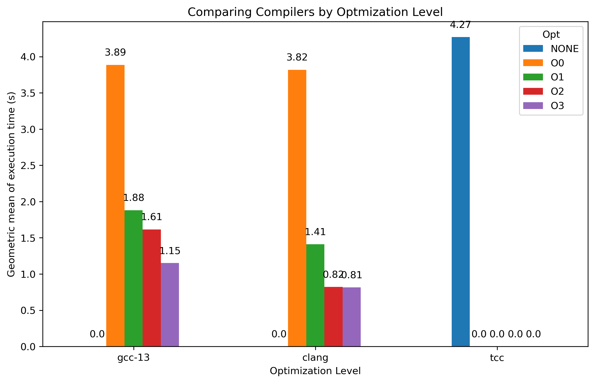
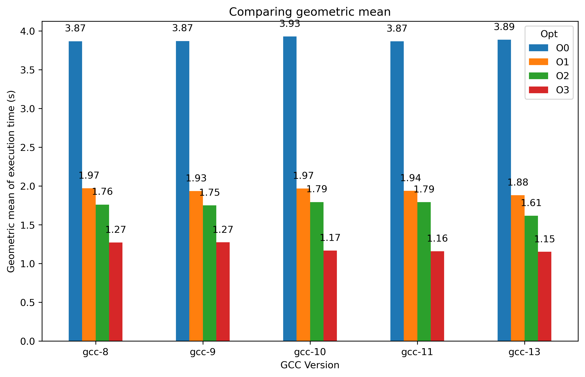

# Comparing Compilers

   
  

## Why to compare compilers?

Comparing compilers is a powerful approach to understanding how different compilers optimize and generate code, significantly 
impacting performance, memory usage, and CPU consumption. This type of experiment can help to identify the scenarios in which 
each compiler performs better.

Different compilers apply various optimization strategies, resulting in codes with different properties. Furthermore, some 
compilers provide a set of optimization flags that allow the user to choose the desired optimization level. Comparing the 
compilers with multiple flags enables us to analyze the impact of these flags as we increase the optimization level across
different compilers.

Comparing compilers and optimizations is essential for reducing the time and cost of running large and widely used applications.
Different optimization techniques applied by various compilers can significantly impact execution speed, memory usage, and overall 
efficiency. Choosing the most efficient compiler and optimization settings for a specific scenario is key to minimizing resource 
consumption, cost, and execution time, especially in fields like scientific computing, high-performance computing, data processing, 
and efficiency-driven systems.

## Which benchmarks can we use?

There are many widely used benchmark collections for comparing compilers, such as [SPEC CPU](https://www.spec.org/cpu2017/), [LLVM Test Suite](https://llvm.org/docs/TestSuiteGuide.html), and [PolyBench](https://www.cs.colostate.edu/~pouchet/software/polybench/). 
Each collection targets different scenarios and domains, including scientific computing, industry applications, embedded systems, 
and programs of varying sizes. Creating benchmarks that capture the unique characteristics of a specific domain can be a limitation
for performance analysis, as it often involves significant cost and effort create the benchmarks and to build comprehensive tests for that scenario. 

### BenchGen: A Benchmark Generator!

We propose the use of a Benchmark Generator, called BenchGen, to test performance and optimization in general cases. BenchGen aims to generate programs that capture the behavior of widely used benchmarks, such as SPEC CPU, based on a variety of metrics.

In this experiment, we use a set of benchmarks generated by the BenchGen tool to compare the performance of three different compilers (GCC, CLANG, and TCC). Additionally, we are interested in comparing different optimization levels across these compilers.
The production rules and the generated programs we have used can be found in the directories [Rules](./Experiment_Set_Rules) and [Programs](./Experiment_Set_Programs).

## Experimental SetUp
### Hardware Configuration

| Component       | Details                                      |
|-----------------|----------------------------------------------|
| CPU             | Intel(R) Xeon(R) CPU E5-2680 v2 @ 2.80GHz    |
| Memory          | 32 GB ECC DDR3                               |

### Software Environment

| Software        | Details                                      |
|-----------------|----------------------------------------------|
| Operating System| Ubuntu 20.04.6 LTS                           |

### Compiler Versions

| Compiler        | Version                                      |
|-----------------|----------------------------------------------|
| Clang           | [16.0.6](https://releases.llvm.org)                                       |
| TCC             | [0.9.27](https://bellard.org/tcc/)                                  |
| GCC             | [13.1.0](https://gcc.gnu.org/gcc-13/)                                     |
| GCC             | [11.4.0](https://gcc.gnu.org/gcc-11/)                                      |
| GCC             | [10.5.0](https://gcc.gnu.org/gcc-10/)                                     |
| GCC             | [9.4.0](https://gcc.gnu.org/gcc-9/)                                     |
| GCC             | [8.4.0](https://gcc.gnu.org/gcc-8/)                                     |

## Comparing Running Time

For the initial analysis, we were interested in comparing the total (absolute) difference in the time taken to run all the benchmarks.
First, we compared the total time each compiler (GCC 13, TCC, and CLANG 16) took to run the 10 benchmarks. However, the absolute difference metric 
is strongly affected by outliers. To minimize these effects, we calculated the geometric mean of the times.

   
  
  

   
  
  

As a result, TCC was slower than both GCC and CLANG without optimizations, being 9.7% slower than GCC and 11.7% slower than CLANG when comparing the geometric means. 
The GCC and CLANG compilers had similar performance without optimizations, with a slight advantage for CLANG. However, CLANG's advantage increased as we raised
the optimization level. Additionally, we observed that CLANG converged at -O2, while there was a gap between GCC -O2 and -O3.

## Comparing Version of GCC

In this experiment, we are interested in the evolution of the GCC compiler, including its optimizations. As in the first experiment, we compared the absolute difference and the geometric mean difference between the compilers.

   
  

   
  

The performance of GCC at -O0 is quite stable, showing small differences. However, when looking at the other optimization levels, GCC demonstrates consistent performance improvement. Comparing GCC 8 and GCC 13, we observe that GCC 13 is 9% faster than GCC 8 at -O3.

## Conclusion
