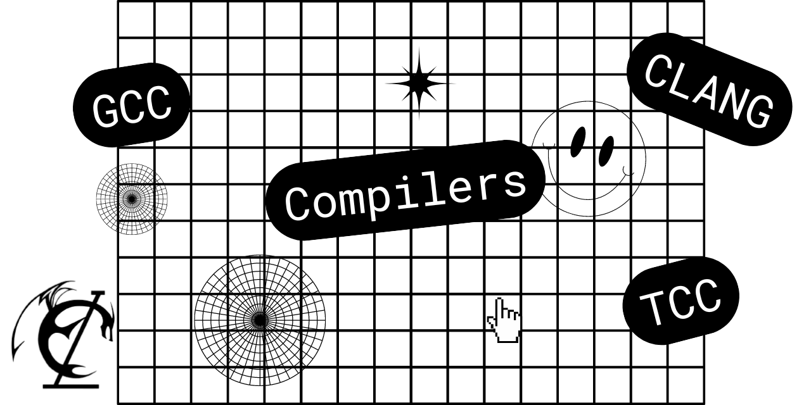
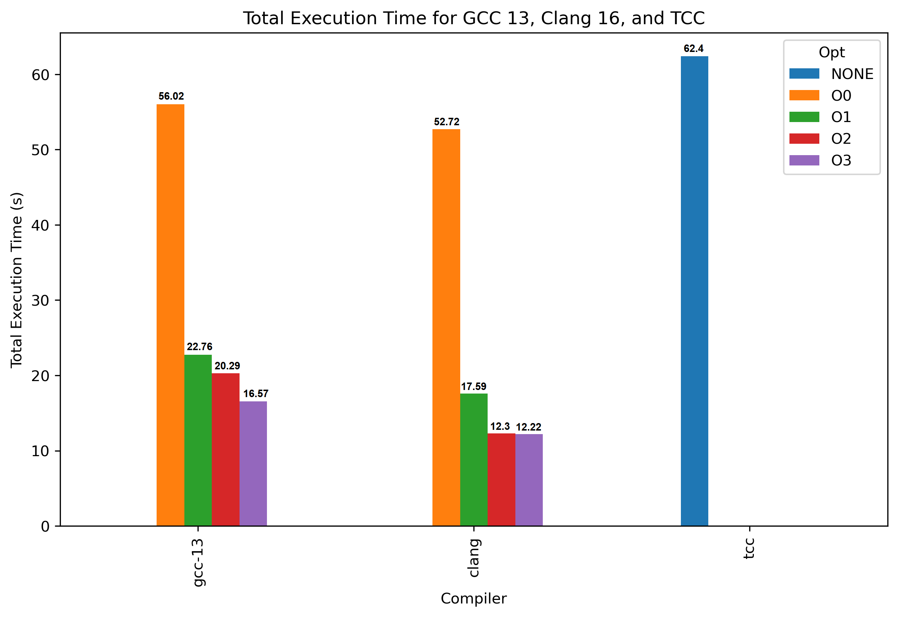
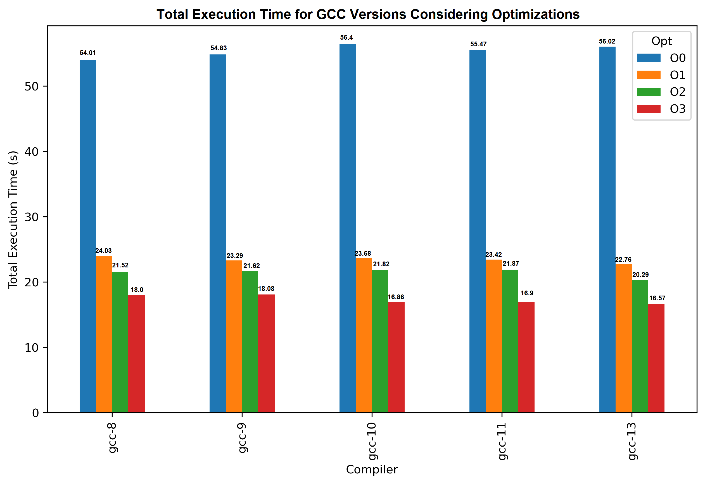

# Comparing Compilers

   
  

## Why to compare compilers?

Comparing compilers is a powerful approach to understanding how different compilers optimize and generate code, significantly 
impacting performance, memory usage, and CPU consumption. This type of experiment can help to identify the scenarios in which 
each compiler performs better.

Different compilers apply various optimization strategies, resulting in codes with different properties. Furthermore, some 
compilers provide a set of optimization flags that allow the user to choose the desired optimization level. Comparing the 
compilers with multiple flags enables us to analyze the impact of these flags as we increase the optimization level across
different compilers.

Comparing compilers and optimizations is essential for reducing the time and cost of running large and widely used applications.
Different optimization techniques applied by various compilers can significantly impact execution speed, memory usage, and overall 
efficiency. Choosing the most efficient compiler and optimization settings for a specific scenario is key to minimizing resource 
consumption, cost, and execution time, especially in fields like scientific computing, high-performance computing, data processing, 
and efficiency-driven systems.

## Which benchmarks can we use?

There are many widely used benchmark collections for comparing compilers, such as [SPEC CPU](https://www.spec.org/cpu2017/), [LLVM Test Suite](https://llvm.org/docs/TestSuiteGuide.html), and [PolyBench](https://www.cs.colostate.edu/~pouchet/software/polybench/). 
Each collection targets different scenarios and domains, including scientific computing, industry applications, embedded systems, 
and programs of varying sizes. Creating benchmarks that capture the unique characteristics of a specific domain can be a limitation
for performance analysis, as it often involves significant cost and effort create the benchmarks and to build comprehensive tests for that scenario. 

### BenchGen: A Benchmark Generator!

We propose the use of a Benchmark Generator, called BenchGen, to test performance and optimization in general cases. BenchGen aims to generate programs that capture the behavior of widely used benchmarks, such as SPEC CPU, based on a variety of metrics.

In this experiment, we use a set of benchmarks generated by the BenchGen tool to compare the performance of three different compilers (GCC, CLANG, and TCC). Additionally, we are interested in comparing different optimization levels across these compilers.

## Experimental SetUp
### Hardware Configuration

| Component       | Details                                      |
|-----------------|----------------------------------------------|
| CPU             | Intel(R) Xeon(R) CPU E5-2680 v2 @ 2.80GHz    |
| Memory          | 32 GB ECC DDR3                               |

### Software Environment

| Software        | Details                                      |
|-----------------|----------------------------------------------|
| Operating System| Ubuntu 20.04.6 LTS                           |

### Compiler Versions

| Compiler        | Version                                      |
|-----------------|----------------------------------------------|
| Clang           | [16.0.6](https://releases.llvm.org)                                       |
| TCC             | [0.9.27](https://bellard.org/tcc/)                                  |
| GCC             | [13.1.0](https://gcc.gnu.org/gcc-13/)                                     |
| GCC             | [11.4.0](https://gcc.gnu.org/gcc-11/)                                      |
| GCC             | [10.5.0](https://gcc.gnu.org/gcc-10/)                                     |
| GCC             | [9.4.0](https://gcc.gnu.org/gcc-9/)                                     |
| GCC             | [8.4.0](https://gcc.gnu.org/gcc-8/)                                     |

## Comparing Running Time

   
  
  

## Comparing Version of GCC

   
  

## Conclusion
